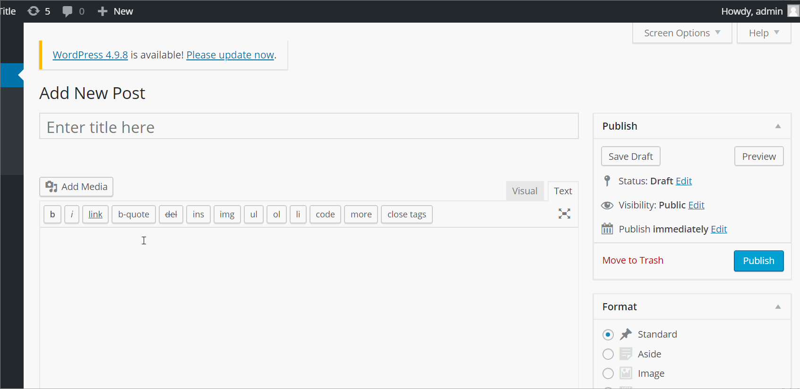
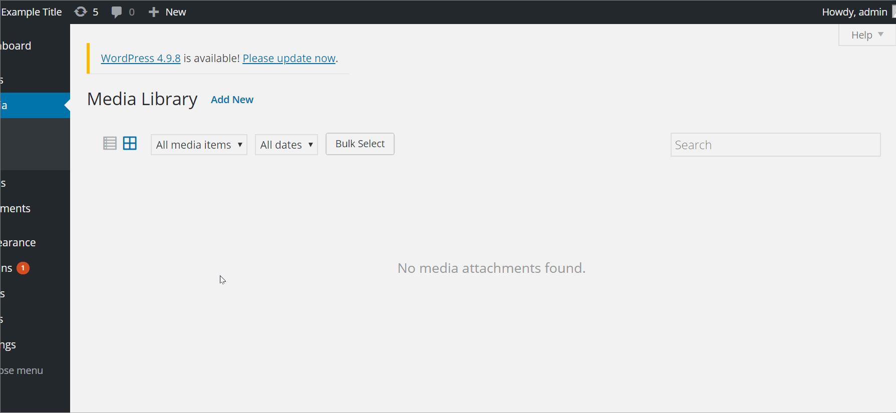
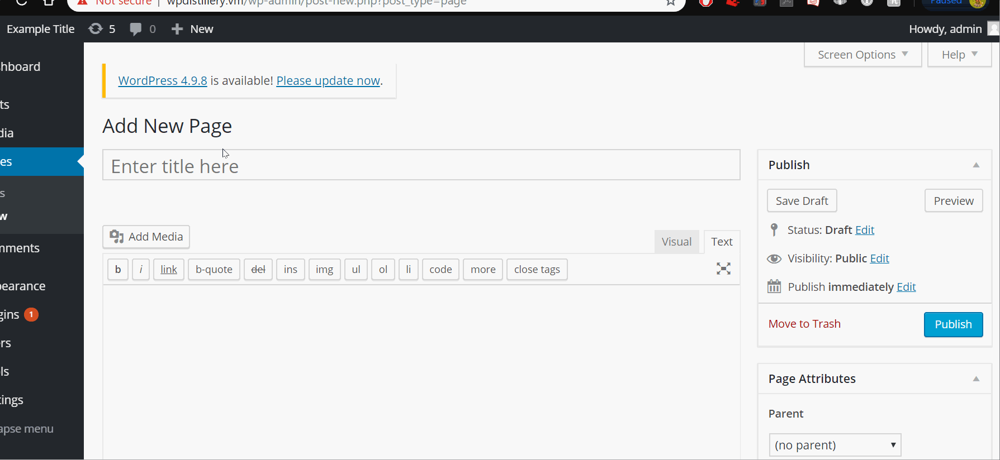

# Project 7 - WordPress Pentesting

Time spent: **6** hours spent in total

> Objective: Find, analyze, recreate, and document **five vulnerabilities** affecting an old version of WordPress

## Pentesting Report

1. (Required) Authenticated stored cross-site scripting
  - [x] Summary: 
    - Vulnerability types: XSS
    - Tested in version: 4.2
    - Fixed in version: 4.6.1
  - [x] GIF Walkthrough: 
    - 
  - [x] Steps to recreate: Make a new post, title the post anything you want and paste ```<a onmouseover= "alert('Hacked!!!')" >click here</a>``` into the text area. Click "Preview" and the post will appear. An alert will show up each time you hover your cursor over the "click here" link.
  - [x] Affected source code:
    - [Link 1](https://core.trac.wordpress.org/browser/branches/4.2/src/wp-includes/class-wp-editor.php?rev=33361)
2. (Required) Authenticated stored cross-site scripting with Image Title
  - [x] Summary: 
    - Vulnerability types: XSS
    - Tested in version: 4.2
    - Fixed in version: 
  - [x] GIF Walkthrough: 
     - 
  - [x] Steps to recreate: On the create media page, upload a picture from your computer. Once you upload the picture, click the image and enter the following code into the Title field: ```filename.png```. Now click on "View attachment page" and the alert will show up.  
  - [ ] Affected source code:
    - [Link 1](https://core.trac.wordpress.org/browser/branches/4.2/src/wp-admin/includes/media.php)
3. (Required) User Enumeration Inconsistency
  - [x] Summary: 
    - Vulnerability types: User Enumeration
    - Tested in version: 4.2
    - Fixed in version: 4.7.5
  - [x] GIF Walkthrough: 
    - 
  - [x] Steps to recreate: On the sign in page, put admin in the username field without a password. Next put a random password that isn't correct. Lastly, try to login as some random user with a random password. It shows whether a user exists or not.
  - [x] Affected source code:
    - [Link 1](https://www.wpwhitesecurity.com/wordpress-security/wordpress-username-disclosure-vulnerability/)
1. (Optional) Embeded URL
  - [x] Summary: 
    - Vulnerability types: Embeded URL
    - Tested in version: 4.2
    - Fixed in version: 4.2.13
  - [x] GIF Walkthrough: 
    - 
  - [x] Steps to recreate: Create a new page, title it anything and paste ```[embed src='https://youtube.com/embed/123\x3csvg onload=alert(7331)\x3e'][/embed]``` below. Then click to preview the page, and the alert will display
  - [x] Affected source code:
    - [Link 1](https://github.com/WordPress/WordPress/commit/419c8d97ce8df7d5004ee0b566bc5e095f0a6ca8)
 
## Assets

N/A

## Resources

- [WordPress Source Browser](https://core.trac.wordpress.org/browser/)
- [WordPress Developer Reference](https://developer.wordpress.org/reference/)

GIFs created with [LiceCap](http://www.cockos.com/licecap/).

## Notes

A bit time consuming trying a bunch of different tactics into many different places.

## License

    Copyright [2018] [Luis Bueno]

    Licensed under the Apache License, Version 2.0 (the "License");
    you may not use this file except in compliance with the License.
    You may obtain a copy of the License at

        http://www.apache.org/licenses/LICENSE-2.0

    Unless required by applicable law or agreed to in writing, software
    distributed under the License is distributed on an "AS IS" BASIS,
    WITHOUT WARRANTIES OR CONDITIONS OF ANY KIND, either express or implied.
    See the License for the specific language governing permissions and
    limitations under the License.
